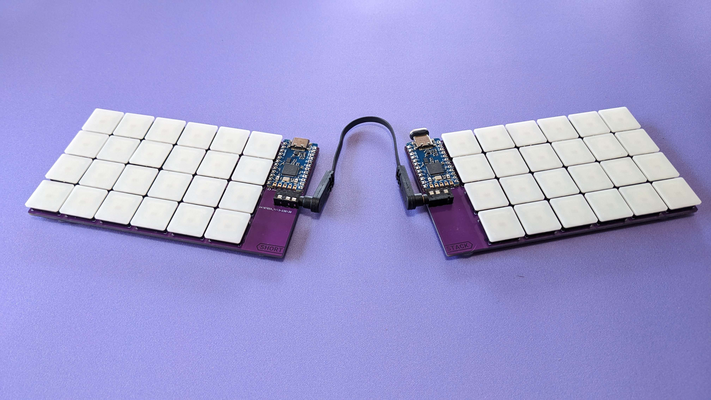

# shortstack

| Left | Right |
| :---: | :---: |
|   |  |

## ultrathin split ortholinear

Probably my final X Switch novelty board.  Split 6x4 ortho.  No bells or whistles.

## MATERIALS
- 48x [Kailh X Switches](https://mkultra.click/kailh-x-switches-and-keycaps/)
- 48x [1N4148 - SOD-123 Diodes](https://mkultra.click/diode-1n4148-sod-123f/)
- 2x ProMicro compatible controller
- 2x [TRRS Jack](https://mkultra.click/pj-320a-3-5mm-trrs-jack/)

## Build Details
- reversible pcb.
- solder jumpers on back of each side.
- controller is installed component side up.
- right side is connected to computer.

## FIRMWARE

[QMK](https://github.com/jasonhazel/qmk_hazel/tree/master/keyboards/jasonhazel/shortstack)

## SUPPORT

<a property="dct:title" rel="cc:attributionURL" href="https://github.com/jasonhazel/shortstack">shortstack</a> by <a rel="cc:attributionURL dct:creator" property="cc:attributionName" href="https://github.com/jasonhazel">Jason Hazel</a> is licensed under <a href="http://creativecommons.org/licenses/by/4.0/?ref=chooser-v1" target="_blank" rel="license noopener noreferrer" style="display:inline-block;">CC BY 4.0</a>

